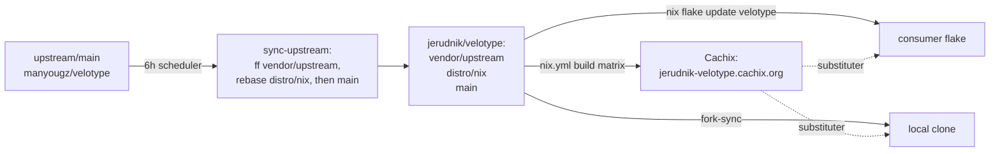

# Fork branch maintenance

This fork is maintained as a downstream stack on three rails:

> **Branch rail reminder**
>
> - `vendor/upstream` = clean upstream, no downstream edits.
> - `distro/nix` = reusable Nix packaging.
> - `main` = stable custom fork.
> - topic branches (`exp/*`, `pr/*`, `shim/*`) = work in progress before folding in.

```mermaid
gitGraph
  commit id: "upstream"
  branch "distro/nix"
  checkout "distro/nix"
  commit id: "flake packaging"
  branch main
  checkout main
  commit id: "custom fork patches"
```

## Branch roles

| Branch | Role | Allowed original commits |
|---|---|---|
| `vendor/upstream` | Exact mirror of `manyougz/velotype` primary branch | None |
| `distro/nix` | `vendor/upstream` plus flake packaging, HM module, cache, docs, and CI | Reusable packaging/distribution changes |
| `main` | Stable daily custom fork over `distro/nix` | Compatibility fixes, shims, features, behavior changes, fork docs |

Use short-lived topic branches for work in progress:

| Prefix | Purpose |
|---|---|
| `exp/<topic>` | Experiment over `main` |
| `pr/<topic>` | Work intended for upstream PR |
| `shim/<topic>` | Temporary compatibility workaround |
| `archive/<name>` | Safety copy of old branch tips |

## Safe status check

Run this before changing branches (read-only apart from `git fetch`):

```sh
nix run github:jerudnik/4nix-utilities#fork-status
```

It reports whether the fork mirror matches upstream, the commits carried by
`distro/nix` beyond the mirror, the commits carried by `main`
beyond `distro/nix`, plus open PRs and recent CI runs.

To validate the rail model and Nix packaging hygiene (including the
dependency-cache-stability invariant), run:

```sh
nix run github:jerudnik/4nix-utilities#fork-doctor
```

## Updating from upstream

Automated upstream sync runs every six hours through the default-branch
`Fork maintenance` scheduler. To trigger it manually:

```sh
gh workflow run "Fork maintenance" --repo jerudnik/velotype -f task=sync-upstream
```

The workflow sets `vendor/upstream` to `upstream/main`, rebases
`distro/nix`, then rebases `main`. Pushes use `--force-with-lease`.

## Pulling the reconciled stack down to a local clone

CI is the writer; a local clone only goes stale. Because `sync-upstream`
force-rebases the downstream rails, a plain `git pull` will report divergence.
Use the synchronizer instead, which resets/rebases each rail to the fork tip
without losing local-only work and auto-stashes a dirty tree:

```sh
nix run github:jerudnik/4nix-utilities#fork-sync -- --check   # report drift
nix run github:jerudnik/4nix-utilities#fork-sync              # reconcile all rails
```

Policy per rail:

- `vendor/upstream`: hard-reset to the fork mirror (aborts loud if it somehow
  carries local-only commits).
- `distro/nix`, `main`: reset when strictly behind, otherwise
  rebase local commits onto the fork tip. A rebase conflict aborts cleanly.

## End-to-end maintenance loop



| Surface | Updated by | Authoritative? |
|---|---|---|
| `upstream/main` | upstream maintainers | source of truth for upstream code |
| `jerudnik/velotype` rails | `Fork maintenance` CI every 6h | yes (only writer) |
| Cachix `jerudnik-velotype` | `nix.yml` build matrix on push | prebuilt artifact cache |
| local clone | `fork-sync` | read-only mirror of the fork |
| consumer `velotype` input | `nix flake update velotype` | consumer pin |

## Updating the consumer pin

A consumer flake pins `velotype.url = "github:jerudnik/velotype/main"`. Its
`flake.lock` only moves when bumped:

```sh
nix flake update velotype   # repin to the latest reconciled tip
nix flake check            # or the repo's validation gate
git commit -m "chore(flake): bump velotype" flake.lock
```

Prefer bumping after the `Nix` build matrix is green for that rev, so the Cachix
cache is already populated and the consumer never builds locally.

## Patch classes

Use commit prefixes that describe why a downstream change exists:

| Prefix | Meaning |
|---|---|
| `compat(...)` | Compatibility with provider, protocol, runtime, OS, or upstream drift |
| `shim(...)` | Temporary workaround with a retirement path |
| `feature(...)` | Fork-only capability |
| `behavior(...)` | Intentional semantic/default behavior change |
| `distro(...)` | Packaging, Nix, release, cache, install, or CI glue |
| `docs(...)` | Documentation and roadmap notes |
| `test(...)` | Regression or harness-only change |

Temporary shims and upstreamable compatibility fixes must be tracked in
`docs/fork/patch-ledger.md`.

## CI ownership

- Upstream Rust and product CI belongs to upstream.
- Nix reproducibility, supported platform builds, Cachix publishing, and
  flake.lock update PRs belong to `distro/nix`.
- Stable custom fork validation belongs to `main`.
- `x86_64-darwin` is intentionally unsupported.
